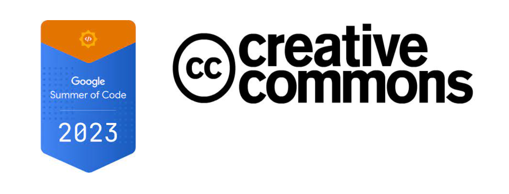

<h1 align = "center">GSoC'23 Report</h1>

<h2>Project : Extend The <a href = "https://github.com/creativecommons/cc-legal-tools-app"> CC-legal Tools App </a></h2>

  

| **Contributer**    | Saurabh Kumar                                                                                                 |
| :------            | :-------------------------------------------------------------------------------------------------------------|
| **Mentor**         | [Timid Robot Zehta](https://github.com/TimidRobot)                                                            |
| **Organisation**   | [Creative Commons](https://creativecommons.org/)                                                              |
| **Project**        | [CC LEGAL TOOLS: MACHINE READABLE LAYER](https://summerofcode.withgoogle.com/programs/2023/projects/9m8Ttuvo) |
| **Github**         | [0saurabh0](https://github.com/0saurabh0)                                                                     |   
| **Email**          | <a href="saurabhrai1717@gmail.com">saurabhrai1717@gmail.com</a>                                               |

# About Project
- ## The Problem
    The core elements of the CC Legal Tools consist of three vital components: the legal code itself, the accompanying deed that offers a description in simplified language, and the underlying machine-readable layer. Unfortunately, the machine-readable layer has not undergone substantial updates in recent times, leading to unresolved problems and the use of outdated technology. Moreover, regrettably, the CC Legal Tools have simply copied the legacy RDF/XML without making necessary improvements.

- ## Primary Goals of the Project 

    To address the above issues, the solution involves extending the CC Legal Tools App's functionality to generate deterministic RDF/XML files for each CC tool and license.

    - ### Benefits After The Project Completetion 

        **Enhanced Structure and Consistency:** 
        - The new RDF/XML format introduces a meticulously organized and standardized structure, adhering to RDF standards.
        - This elevated structure improves machine comprehension, enabling precise data processing and interpretation.
        
        
        **Robust License Information:** 
        - License information has undergone comprehensive updates to mirror the latest permissions and constraints accurately.
        - This meticulous revision ensures that users and systems are provided with up-to-date and reliable insights.
        
        
        **Alignment with RDF Best Practices:** 
        - The introduced changes align the representation seamlessly with established RDF best practices.
        - By incorporating standardized namespaces, maintaining consistent nomenclature, and accurately defining relationships, enhanced interoperability and compatibility are fostered.
        

    ## Overall Impact
    This project not only resolves existing issues but also modernizes the CC legal tools, making them more accessible, reliable, and user-friendly. This aligns with the broader goal of facilitating the sharing and use of creative works while maintaining legal clarity.

# Contributions and The Work
As the project involved creating a system that generates RDF/XML files conforming to the latest specifications for all versions of Creative Commons licenses. the journey began with an intensive learning phase where I familiarized myself with the project's codebase, existing tools, and the concepts of RDF (Resource Description Framework) and RDF/XML.

  - ## Development Process
    - ### Technical Aspects
      - **Utilizing `rdflib` for RDF Generation**   
          I employed the `rdflib` library, a popular Python library for working with RDF data, to facilitate the generation of RDF/XML files. This library provided the necessary tools to define namespaces i.e. `rdflib.namespace`, create RDF triples, and structure the XML representation of the licenses and tools.
      
      - **Dynamic Generation of RDF/XML**   
          To achieve the goal of generating RDF/XML files for different Creative Commons licenses and tools, I dynamically created RDF triples for license version and its associated attributes. This involved constructing the appropriate RDF elements, such as subjects, predicates, and objects, to accurately represent the licenses.

      - **Namespace Management**   
          In collaboration with mentor, I meticulously managed namespaces to ensure that the RDF/XML files adhered to best practices and maintained compatibility with the CC Legal Tools ecosystem. This included using built-in `rdflib namespaces` and adapting to specific requirements.

      - **Sorting for Consistency**   
          Understanding the importance of consistent representation, a sorting mechanism to arrange the RDF elements within the generated RDF/XML files is implemented. This sorting ensured that the files were organized and more reader-friendly. 
          The credit goes to *Timid Robot*.
          

    - ## Collaboration  
         - ### Throughout the GSoC, collaboration was the key:  
            I actively engaged with mentor, seeking guidance on technical challenges and aligning my work with project goals.  
            
            Regular discussions with mentor provided clarity on Creative Commons specifications and RDF best practices.  
            
            Feedback from mentor enriched my understanding and significantly influenced the quality of my work.  

    - ## And much more ....  

- # **All of the work done during GSoC can be found [HERE](https://github.com/creativecommons/cc-legal-tools-app/pull/357)**

## Mentorship and Gratitude
  I extend my heartfelt appreciation to my mentor, [***Timid Robot***](https://github.com/TimidRobot), for being an unwavering source of guidance and support throughout this remarkable journey. Your invaluable insights, patient guidance, and willingness to share your expertise have been instrumental in my growth and learning. Your mentorship has made this journey an unforgettable experience, and I am truly grateful for the opportunity to have worked with you.

## Lessons Learned and Future Prospects
Through this project, I acquired in-depth knowledge of `RDF`, `RDF/XML`, `Django` etc and the intricacies of working with open-source projects. The experience highlighted the significance of effective communication, collaboration, and problem-solving within the context of software development.

Looking ahead, I am excited about the potential for further enhancements, the groundwork laid during this project establishes a strong foundation for further enhancements like exploring external application integration possibilities.

## Thanks to [Creative Commons](https://creativecommons.org/) and [Timid Robot](https://github.com/TimidRobot) for providing me with an incredible Summer of Code experience!

  ************

